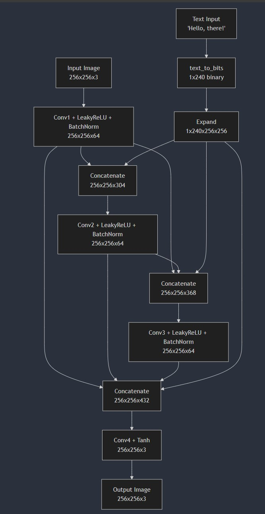

1. Place an image in the steganography folder
2. Run the model:
    ```bash
    python steganography/main.py
    ```

Model Architecture:

parameters:
- data_depth: 240 (this parameter sets the limit on the length of the text to be encoded)
- hidden_size: 64 (number of channels in the hidden layer)


